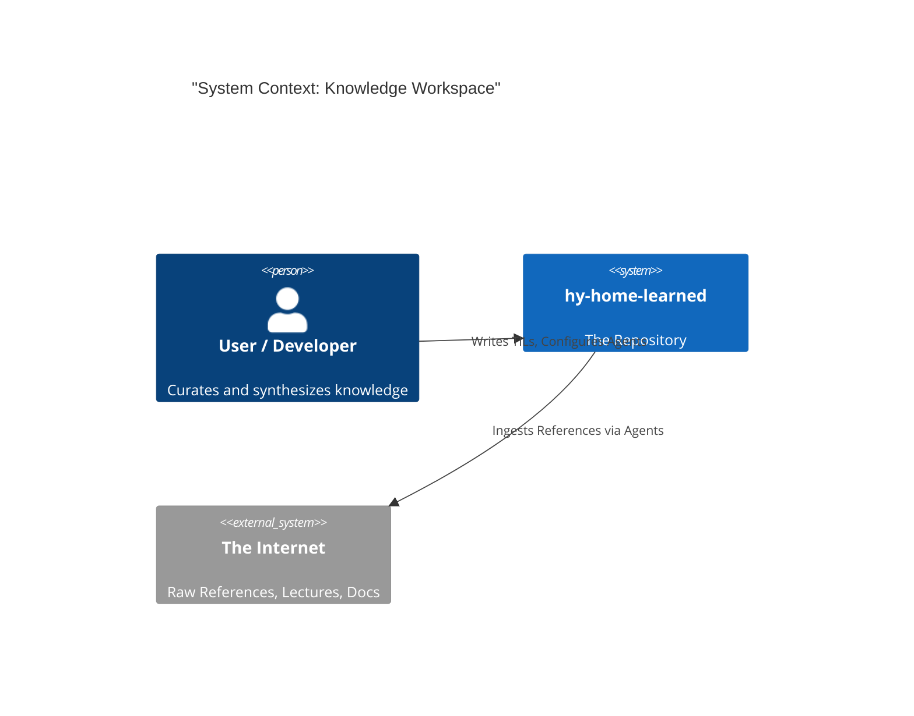

# System Architecture

## 1. Context

`hy-home-learned` acts as a **Personal Knowledge Operating System**, bridging the gap between raw information and executable wisdom.

## 2. Layered Architecture

The system is composed of four strict layers:

### Layer 1: The Brain (`.agent/`)

- **Responsibility**: Governance, Reasoning, and Automation.
- **Components**:
  - `rules/`: Immutable laws (Linting standards, Agent Personas).
  - `workflows/`: Action scripts (e.g., "Summarize this PDF").

### Layer 2: The Pipeline (`.github/`)

- **Responsibility**: Verification and Delivery.
- **Components**:
  - `ci.yml`: Quality gates (Ruff, Mypy).
  - `labeler.yml`: Automated triage.

### Layer 3: The Manual (`docs/`)

- **Responsibility**: Human-readable explanation.
- **Components**: `index.md`, `project-mission.md`, ADRs.

### Layer 4: The Knowledge (`TIL/` & `References/`)

- **Responsibility**: The core value store.
- **Components**:
  - `References`: Raw inputs.
  - `TIL`: Processed outputs.

## 3. Key Decisions (ADRs)

- **ADR-001**: Use `uv` for package management (Speed, Unity).
- **ADR-002**: Structure `TIL` by Date (Chronological learning is easier to maintain than strict topical hierarchies).
